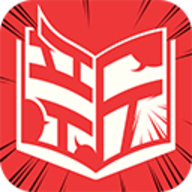

<!DOCTYPE html>
<html lang="en">
<head>
<meta charset="UTF-8">
<title>Industrial-Grade OOD - Web Comic System</title>

</head>
<body>

<h1>Fat Bun Universe - Web Comic & E-Commerce Platform</h1>

<h2>Project Background</h2>

    <h3>Story</h3>
    
I created my own original comic IP <strong>"Pan Pan Rabbit"</strong>, and got nominated for the  Xingmanhua The 1st Global 4-Panel Comic Competition in 2021. That recognition helped me gather a small but loyal fanbase, and I started thinking: why not give them a proper home to follow the comics, get updates, and even grab some fun merchandise?
    

    <h3>Goals</h3>
    
So I set out to build an official website for my brand <strong>"Fat Bun Universe"</strong>, with three main goals:

    <ul>
        <li>Let fans read the comics effortlessly for free.</li>
        <li>Provide official updates and news.</li>
        <li>Offer merchandise and brand goodies.</li>
    </ul>
    <h3>Challenge</h3>
    
But I didn’t want to spend any money 💸, so I started reaseaching for how to build a full-featured site with free hosting, CMS, while keeping the system scalable, maintainable, modular, stable, and efficient.

    

     
     
    

    <h3>Solution</h3>
    
Finally I used Angular + TypeScript, HTML, CSS for the frontend, C# + .NET for the backend, SQL database, Stripe API for payments, all running in Docker, deployed via Azure Student Plan.

    <h3>Brand Unique selling proposition(USP)</h3>
    
We all orbit our own tiny planets. In the boundless Fat Bun Universe, today your planet touches Pan Pan Rabbit’s — let the adventure begin.

<h2>Technology Stack</h2>

    
Main technologies and services used:

    

        TypeScript
        Angular
        C#
        .NET
        MS SQL / Free DB
        Docker
        Azure Web Services (AWS)
        Redis (Cache)
        Stripe API
        HTML5
        CSS3
        JavaScript
        Mermaid.js
        Git
        Infrastructure / API
        Figma
        Adobe Photoshop
        VS Code
        Object Oritened Design
    

<h2>Project Statement</h2>

    
The goal is to create a scalable, maintainable, and visually appealing website that combines comic reading, updates/newsfeed, online shop, and fan interaction using industrial-grade OOD principles. The system is robust, modular, and extensible.

<h2>OOD Diagram</h2>

flowchart TD
    A[Backlog] --> B[Sprint Planning]
    B --> C[Content Editing & Upload]
    C --> D[Viewer Feature Implementation]
    D --> E[Merchandise Setup]
    E --> F[Functions Implementation]
    F --> G[API Integration]
    G --> H[Frontend Testing]
    G --> I[Backend Testing]
    H --> J[Deployment & Release]
    I --> J
    J --> K[User Feedback]
    K --> B

    style A fill:#2e3b4e,stroke:#fff,stroke-width:1px
    style B fill:#3b5e7e,stroke:#fff,stroke-width:1px
    style C fill:#2e7d32,stroke:#fff,stroke-width:1px
    style D fill:#388e3c,stroke:#fff,stroke-width:1px
    style E fill:#689f38,stroke:#fff,stroke-width:1px
    style F fill:#fbc02d,stroke:#fff,stroke-width:1px,color:#000
    style G fill:#f57c00,stroke:#fff,stroke-width:1px
    style H fill:#d32f2f,stroke:#fff,stroke-width:1px
    style I fill:#c2185b,stroke:#fff,stroke-width:1px
    style J fill:#0288d1,stroke:#fff,stroke-width:1px
    style K fill:#546e7a,stroke:#fff,stroke-width:1px

</body>
</html>
